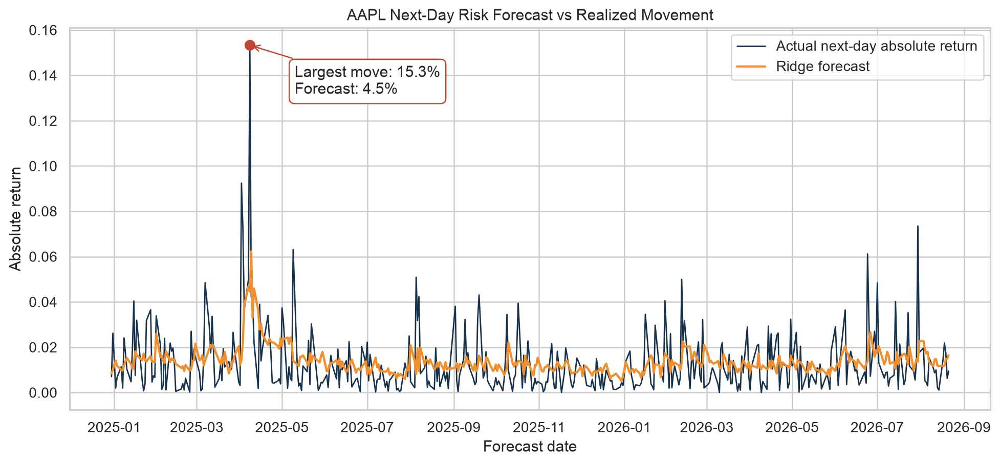
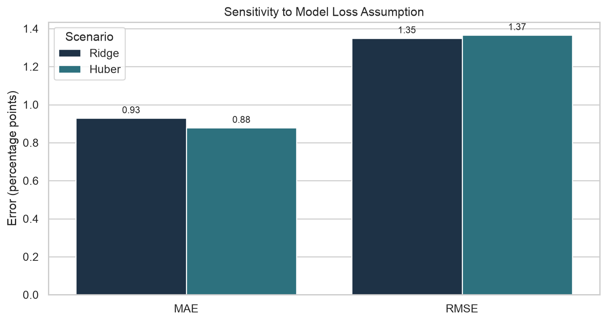
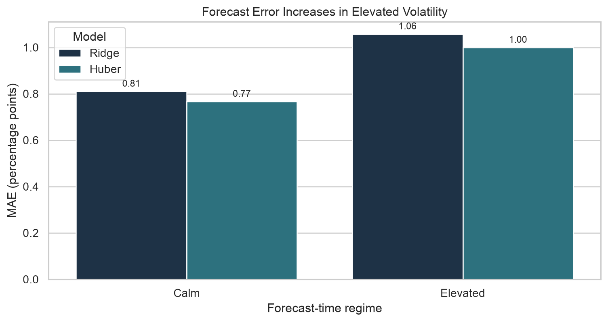

# AAPL Next-Day Volatility Forecast

Decision brief for a portfolio risk analyst. Educational prototype; not investment advice.

## Executive summary

- Use the model to rank next-day monitoring attention, not to automate hedges, exposure limits, or trades.
- Escalate human review when current 21-day daily volatility exceeds 1.60%; Ridge MAE is about 31% higher in that regime.
- Robust Huber loss improves typical-day MAE by 5.4% but worsens RMSE by 1.2%, so it does not solve the costliest tail misses.

Recommended decision: adopt Ridge as a transparent monitoring baseline with a volatility-regime escalation rule. Do not rely on the point forecast alone during elevated or unfamiliar conditions.

## Forecast behavior

The forecast responds to changing risk but compresses genuine shocks. On the forecast date associated with the largest held-out outcome, the next-day absolute return was 15.33% while Ridge predicted 4.46%. The model identified increased risk but substantially understated its magnitude.

Assumption and limitation: lag, range, volume, and rolling-volatility relationships learned from history must remain relevant. Event shocks and new regimes can break that assumption.

## Model-assumption sensitivity

Ridge uses squared loss; Huber reduces the influence of fat-tailed residuals. On identical held-out dates, Huber lowers MAE from 0.93 to 0.88 percentage points but raises RMSE from 1.35 to 1.37 points. The alternate assumption improves a typical forecast but slightly worsens large-error performance.

## Operating-regime sensitivity

Using a threshold learned only from training history, Ridge MAE rises from 0.81 percentage points in calm conditions to 1.06 points in elevated volatility. Overall MAE therefore hides the conditions in which risk decisions are hardest.

## Uncertainty

The Ridge test MAE is 0.93 percentage points. Its 95% interval is:

| Assumption | 95% interval |
|---|---:|
| Gaussian mean approximation | 0.83-1.02 pp |
| IID bootstrap, 2,000 resamples | 0.84-1.03 pp |
| Five-day block bootstrap, 2,000 resamples | 0.83-1.05 pp |

The block interval is wider because it preserves short sequences of test dates. All three intervals are conditional on one fixed fitted model and observed evaluation period; they do not cover refitting uncertainty or an unseen crisis.

## Sensitivity summary

| Scenario | Change from baseline | Decision implication |
|---|---:|---|
| Huber robust loss | MAE -5.4%; RMSE +1.2% | Better typical day; no tail-risk cure |
| Elevated volatility | Ridge MAE +30.5% | Escalate human review and widen buffers |
| Five-day dependence | CI width +21% versus IID | Use the block interval for planning |

## Assumptions and risks

- Historical AAPL relationships and vendor data remain representative enough for monitoring.
- Next-day absolute adjusted-close return is a volatility proxy, not a portfolio P&L forecast.
- Correlated rolling features and regime changes can destabilize coefficients and calibration.
- Average metrics conceal tail misses; a favorable MAE does not establish safe crisis performance.
- The prototype supports prediction and monitoring, not causal claims.

## What this means for you

Use the score as one input to daily triage. When current 21-day volatility exceeds 1.60%, require analyst review and do not rely on the point estimate alone. Before operational use, add rolling-origin refits, tail MAE and high-volatility recall, block-bootstrap or conformal intervals, and stress tests on additional crisis periods.
