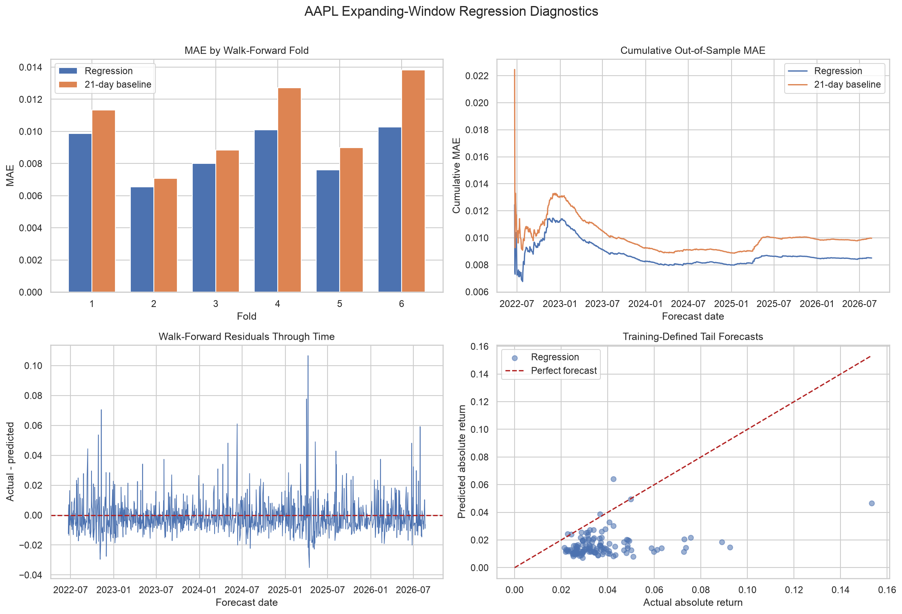
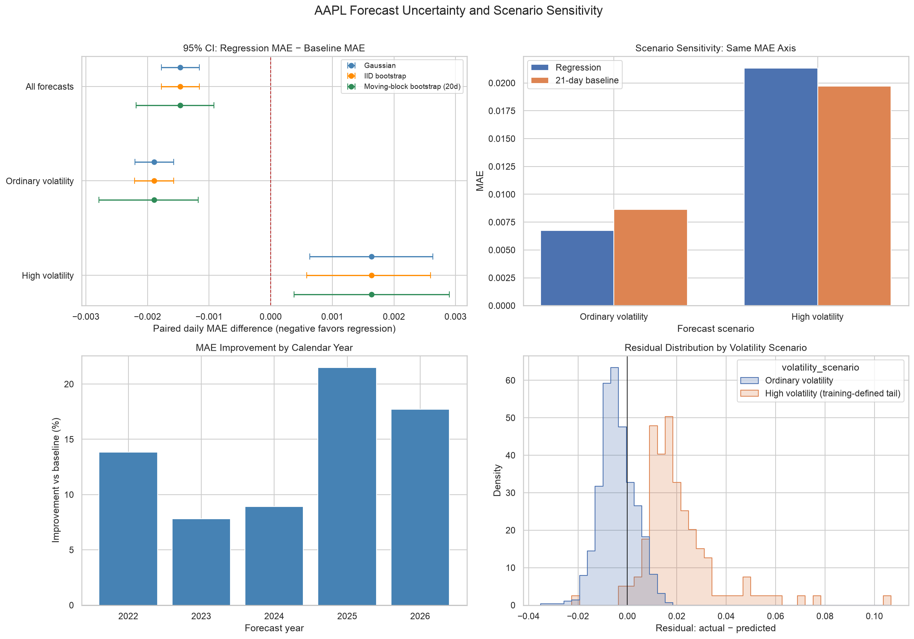

# AAPL Next-Day Volatility Forecasting

## Stakeholder decision brief

**Audience:** Portfolio Risk Lead

**Decision supported:** Whether AAPL exposure requires routine monitoring or an elevated-risk review before the next trading session.

**Decision:** **Advisory only - not approved for automated risk action.**

## Executive summary

The regression improves average next-day absolute-return forecasts relative to a 21-session rolling-volatility baseline, but it is less accurate during high-volatility events. Across 1,047 walk-forward forecasts, model MAE was 0.008505 versus 0.009971 for the baseline, a 14.70% improvement. On 126 training-defined high-volatility observations, model MAE was 0.021342 versus 0.019707, an 8.30% deterioration.

The result is robust to the uncertainty method. The preferred 20-session moving-block bootstrap gives an all-day paired MAE difference of -0.001466 with a 95% interval of [-0.002183, -0.000924], favoring regression. For high-volatility days the paired difference is +0.001635 with a 95% interval of [0.000378, 0.002900], favoring the baseline.

Use regression as a secondary estimate for routine monitoring. Keep the baseline visible and require human review for elevated risk. Do not allow the model to automatically trade, hedge, change exposure limits, or suppress an alert.

## Problem and method

The target is the next session's absolute adjusted-close return, a transparent realized-volatility proxy. Predictors use only information available by the current close: current and lagged returns, normalized intraday range, 5- and 21-session rolling volatility, 5-session mean absolute return, volume change, relative volume, and Monday-Thursday indicators with Friday as the reference.

The evaluation starts with 600 historical observations and then makes 1,047 one-time forecasts in six non-overlapping expanding-window folds from 2022-06-21 through 2026-08-21. In each fold, OLS and Ridge variants are selected using historical validation data, then preprocessing and the selected model are refit using the complete training history.

## Results

| Metric | Regression | Baseline | Interpretation |
|---|---:|---:|---|
| MAE | 0.008505 | 0.009971 | Regression lowers average error by 14.70% |
| RMSE | 0.011949 | 0.013510 | Regression reduces large-error influence overall |
| R-squared | 0.070 | -0.189 | Explanatory power remains limited |
| Fold MAE wins | 6 of 6 | - | Average improvement occurs across all test folds |

## Alternate scenarios and uncertainty

| Scenario | Observations | Regression MAE | Baseline MAE | Improvement |
|---|---:|---:|---:|---:|
| Ordinary volatility | 921 | 0.006749 | 0.008639 | 21.88% |
| Training-defined high volatility | 126 | 0.021342 | 0.019707 | -8.30% |

Gaussian, IID-bootstrap, and moving-block-bootstrap intervals reach the same directional decision. Moving-block intervals are wider because they preserve short error sequences and relax the strongest independence assumption.

## Business implications

- Show regression and baseline together after every close.
- Use either elevated signal to prompt human review of concentration, limits, and market context.
- Never allow regression to override a higher baseline estimate without analyst approval.
- Prioritize tail calibration before building a production interface.
- Revalidate any change to the target, features, threshold, data source, or window design.

## Assumptions and risks

- Historical adjusted OHLCV data are accurate, timely, and consistently revised.
- Current-close features are available before the next-session decision cutoff.
- Expanding history remains relevant despite regime changes.
- Absolute return and the training-period 80th percentile are useful volatility and tail proxies.
- A 20-session circular block captures relevant short-run error dependence.
- IID and Gaussian intervals can understate uncertainty when errors cluster.
- The model systematically underpredicts important large moves.
- Results omit transaction costs, position size, hedging effectiveness, and multi-asset context.

## Production monitoring

Monitor data freshness and schema, feature drift, forecast and residual distributions, rolling paired MAE/RMSE, moving-block intervals, tail MAE and underprediction, model-versus-baseline win rate, and alert frequency. Pause or escalate on stale inputs, a sustained non-negative all-day paired interval, materially worse tail MAE, clustered large residuals, or a regime outside historical coverage. Retraining requires time-ordered revalidation and human approval.

## Scope boundary

This is an educational daily-AAPL prototype. It is not investment advice and excludes intraday deployment, direction prediction, automated trading, multi-asset portfolio optimization, causal claims, and guaranteed service levels.
